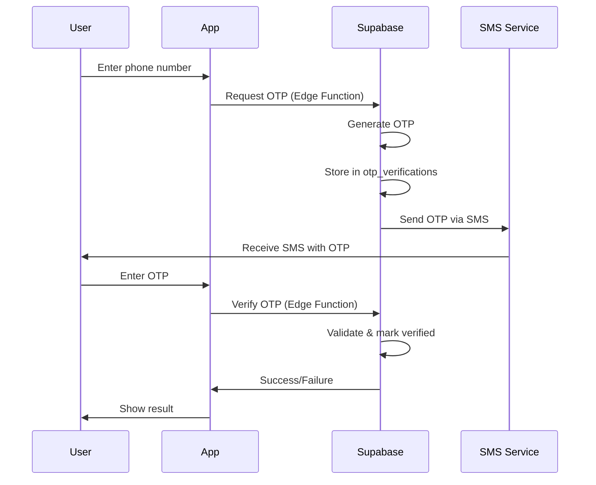

# ClothAR Security Audit & Recommendations

## Executive Summary

This document provides a comprehensive security audit of the ClothAR application's database schema and authentication system, identifying vulnerabilities and proposing improvements.

**Audit Date:** 2025-10-03  
**Database:** Supabase (PostgreSQL)  
**Authentication:** Supabase Auth

---

## Current Implementation Analysis

### ✅ What's Working Well

1. **Row Level Security (RLS)** - Enabled on profiles table
2. **Basic Authentication** - Email/password registration and login implemented
3. **Profile Management** - Automatic profile creation via database trigger
4. **Role-based Access** - Role system with approval workflow (customer, tailor, shop_owner)
5. **Phone Verification UI** - Mock OTP implementation in place

### ❌ Critical Security Vulnerabilities

#### 1. **EXPOSED SUPABASE CREDENTIALS**
**Severity:** 🔴 CRITICAL

**Location:** [`ClothAR/src/services/supabase.ts`](ClothAR/src/services/supabase.ts:3-4)

```typescript
const supabaseUrl = 'https://ctjxkkkuprnrzxkuwoiu.supabase.co'
const supabaseAnonKey = 'eyJhbGciOiJIUzI1NiIsInR5cCI6IkpXVCJ9...'
```

**Risk:** Hardcoded credentials in source code can be extracted from the app bundle.

**Recommendation:**
- Move credentials to environment variables
- Use `.env` files (not committed to git)
- Implement proper secret management

#### 2. **MOCK OTP SYSTEM**
**Severity:** 🔴 CRITICAL

**Location:** [`ClothAR/src/modules/auth/steps/PhoneVerificationStep.tsx`](ClothAR/src/modules/auth/steps/PhoneVerificationStep.tsx:61-64)

```typescript
const mockOtp = Math.floor(100000 + Math.random() * 900000).toString();
setGeneratedOtp(mockOtp);
Alert.alert('OTP Sent', `Your OTP is: ${mockOtp}`); // Remove in production
```

**Risk:** 
- OTP stored in client-side state (easily bypassed)
- No actual SMS verification
- OTP visible in alert (development only)

**Recommendation:**
- Implement server-side OTP generation and validation
- Use Supabase Phone Auth or third-party SMS service (Twilio, AWS SNS)
- Store OTP attempts and implement rate limiting

#### 3. **MISSING PHONE VERIFICATION IN DATABASE**
**Severity:** 🟡 HIGH

**Issue:** No `phone_verified` field in profiles table

**Risk:** Users can register with fake phone numbers without verification

**Recommendation:**
- Add `phone_verified` boolean field
- Add `phone_verified_at` timestamp
- Require verification before certain actions

#### 4. **NO AUDIT LOGGING**
**Severity:** 🟡 HIGH

**Issue:** No tracking of security-sensitive events

**Risk:** Cannot detect or investigate security incidents

**Recommendation:**
- Create audit_logs table
- Log authentication events (login, logout, failed attempts)
- Log profile changes
- Log role changes

#### 5. **MISSING RATE LIMITING**
**Severity:** 🟡 HIGH

**Issue:** No protection against brute force attacks

**Risk:** 
- Unlimited login attempts
- Unlimited OTP requests
- Account enumeration possible

**Recommendation:**
- Implement rate limiting on authentication endpoints
- Add failed login attempt tracking
- Implement account lockout after N failed attempts

#### 6. **NO PASSWORD POLICY ENFORCEMENT**
**Severity:** 🟠 MEDIUM

**Issue:** No minimum password requirements in database or validation

**Risk:** Weak passwords can be used

**Recommendation:**
- Enforce minimum 8 characters
- Require mix of uppercase, lowercase, numbers
- Check against common password lists
- Implement password strength meter in UI

#### 7. **MISSING EMAIL VERIFICATION**
**Severity:** 🟠 MEDIUM

**Issue:** No email verification flow implemented

**Risk:** Users can register with fake emails

**Recommendation:**
- Enable Supabase email confirmation
- Add email verification check before full access
- Implement email verification resend functionality

#### 8. **NO SESSION MANAGEMENT**
**Severity:** 🟠 MEDIUM

**Issue:** No tracking of active sessions or device management

**Risk:** Cannot revoke compromised sessions

**Recommendation:**
- Track active sessions in database
- Allow users to view and revoke sessions
- Implement session timeout policies

#### 9. **GUEST MODE SECURITY**
**Severity:** 🟠 MEDIUM

**Location:** [`ClothAR/src/context/AuthContext.tsx`](ClothAR/src/context/AuthContext.tsx:192-205)

**Issue:** Guest user created with hardcoded ID 'guest'

**Risk:** Potential conflicts, no proper isolation

**Recommendation:**
- Generate unique guest IDs
- Implement proper guest session management
- Clear guest data on logout
- Limit guest capabilities

#### 10. **MISSING ADMIN POLICIES**
**Severity:** 🟠 MEDIUM

**Issue:** Comment in schema mentions admin role but no implementation

**Risk:** No way to manage user roles securely

**Recommendation:**
- Create admin role system
- Add RLS policies for admin access
- Implement role approval workflow

---

## Missing Database Tables

### 1. **OTP Verification Table**
```sql
CREATE TABLE public.otp_verifications (
  id UUID PRIMARY KEY DEFAULT gen_random_uuid(),
  user_id UUID REFERENCES auth.users(id) ON DELETE CASCADE,
  phone TEXT NOT NULL,
  otp_code TEXT NOT NULL,
  attempts INT DEFAULT 0,
  verified BOOLEAN DEFAULT FALSE,
  expires_at TIMESTAMPTZ NOT NULL,
  created_at TIMESTAMPTZ DEFAULT NOW()
);
```

### 2. **Audit Logs Table**
```sql
CREATE TABLE public.audit_logs (
  id UUID PRIMARY KEY DEFAULT gen_random_uuid(),
  user_id UUID REFERENCES auth.users(id) ON DELETE SET NULL,
  action TEXT NOT NULL,
  resource_type TEXT,
  resource_id TEXT,
  ip_address INET,
  user_agent TEXT,
  metadata JSONB,
  created_at TIMESTAMPTZ DEFAULT NOW()
);
```

### 3. **Login Attempts Table**
```sql
CREATE TABLE public.login_attempts (
  id UUID PRIMARY KEY DEFAULT gen_random_uuid(),
  email TEXT NOT NULL,
  ip_address INET,
  success BOOLEAN DEFAULT FALSE,
  attempted_at TIMESTAMPTZ DEFAULT NOW()
);
```

### 4. **User Sessions Table**
```sql
CREATE TABLE public.user_sessions (
  id UUID PRIMARY KEY DEFAULT gen_random_uuid(),
  user_id UUID REFERENCES auth.users(id) ON DELETE CASCADE,
  device_info JSONB,
  ip_address INET,
  last_activity TIMESTAMPTZ DEFAULT NOW(),
  created_at TIMESTAMPTZ DEFAULT NOW(),
  expires_at TIMESTAMPTZ NOT NULL
);
```

---

## Enhanced Database Schema Recommendations

### Profile Table Enhancements

Add the following columns to `public.profiles`:

```sql
ALTER TABLE public.profiles ADD COLUMN IF NOT EXISTS phone_verified BOOLEAN DEFAULT FALSE;
ALTER TABLE public.profiles ADD COLUMN IF NOT EXISTS phone_verified_at TIMESTAMPTZ;
ALTER TABLE public.profiles ADD COLUMN IF NOT EXISTS email_verified BOOLEAN DEFAULT FALSE;
ALTER TABLE public.profiles ADD COLUMN IF NOT EXISTS email_verified_at TIMESTAMPTZ;
ALTER TABLE public.profiles ADD COLUMN IF NOT EXISTS last_login_at TIMESTAMPTZ;
ALTER TABLE public.profiles ADD COLUMN IF NOT EXISTS failed_login_attempts INT DEFAULT 0;
ALTER TABLE public.profiles ADD COLUMN IF NOT EXISTS account_locked_until TIMESTAMPTZ;
ALTER TABLE public.profiles ADD COLUMN IF NOT EXISTS password_changed_at TIMESTAMPTZ;
```

### Add Indexes for Performance

```sql
CREATE INDEX idx_profiles_phone ON public.profiles(phone) WHERE phone IS NOT NULL;
CREATE INDEX idx_profiles_role_status ON public.profiles(role, role_status);
CREATE INDEX idx_audit_logs_user_id ON public.audit_logs(user_id);
CREATE INDEX idx_audit_logs_created_at ON public.audit_logs(created_at);
CREATE INDEX idx_login_attempts_email ON public.login_attempts(email, attempted_at);
```

---

## OTP Implementation Architecture

### Recommended Flow



### Implementation Options

#### Option 1: Supabase Phone Auth (Recommended)
- Built-in phone authentication
- Handles OTP generation and SMS
- Integrated with Supabase Auth
- Requires Twilio integration

#### Option 2: Custom Edge Function + SMS Service
- More control over OTP logic
- Can use any SMS provider (Twilio, AWS SNS, Vonage)
- Requires custom implementation

#### Option 3: Third-party Service
- Services like Firebase Phone Auth
- Auth0 with SMS
- Requires additional integration

---

## Security Best Practices Checklist

### Authentication
- [ ] Move credentials to environment variables
- [ ] Implement real OTP verification with SMS service
- [ ] Add email verification flow
- [ ] Enforce strong password policy
- [ ] Implement rate limiting on auth endpoints
- [ ] Add account lockout after failed attempts
- [ ] Implement session management
- [ ] Add 2FA/MFA option for sensitive accounts

### Database
- [ ] Add phone_verified and email_verified fields
- [ ] Create audit_logs table
- [ ] Create otp_verifications table
- [ ] Create login_attempts table
- [ ] Add indexes for performance
- [ ] Review and test all RLS policies
- [ ] Implement admin role policies

### Application
- [ ] Remove hardcoded credentials
- [ ] Implement proper error handling (don't leak info)
- [ ] Add input validation on all forms
- [ ] Sanitize user inputs
- [ ] Implement CSRF protection
- [ ] Add security headers
- [ ] Regular security audits

### Monitoring
- [ ] Set up logging for security events
- [ ] Monitor failed login attempts
- [ ] Alert on suspicious activities
- [ ] Regular backup of database
- [ ] Implement disaster recovery plan

---

## Priority Action Items

### 🔴 Immediate (Critical)
1. Move Supabase credentials to environment variables
2. Implement real OTP verification system
3. Add rate limiting to prevent brute force attacks

### 🟡 Short-term (High Priority)
1. Add phone_verified field and verification flow
2. Create audit_logs table and implement logging
3. Add email verification
4. Implement password policy enforcement

### 🟠 Medium-term
1. Add session management
2. Implement admin role system
3. Add 2FA/MFA option
4. Create security monitoring dashboard

---

## Conclusion

The current implementation has a solid foundation with Supabase Auth and RLS, but requires significant security enhancements before production deployment. The most critical issues are the exposed credentials and mock OTP system, which must be addressed immediately.

The recommended improvements will significantly enhance the security posture of the ClothAR application and protect user data from common attack vectors.