# ClothAR System Architecture Flowchart

## Overview
ClothAR is a React Native mobile application for virtual clothing try-on and custom tailoring services. The system integrates AR technology, e-commerce functionality, and admin management tools.

## System Architecture Flowchart

```mermaid
graph TB
    %% User Entry Points
    subgraph "User Entry Points"
        A[Mobile App Launch]
        B[Onboarding Screen]
        C[Authentication Flow]
    end

    %% Core Application Structure
    subgraph "Core App Structure"
        D[Error Boundary]
        E[Network Provider]
        F[Toast Provider]
        G[Notification Provider]
        H[Auth Provider]
        I[Inventory Provider]
        J[Cart Provider]
        K[Navigation Container]
        L[Root Navigator]
    end

    %% Navigation Structure
    subgraph "Navigation Structure"
        M[Onboarding Check]
        N[Auth Check]
        O[Main Tabs Navigator]
        P[Stack Navigator]
    end

    %% Main User Flows
    subgraph "Main User Flows"
        Q[Dashboard/Home]
        R[AR Virtual Try-On]
        S[Chat Support]
        T[Shopping Cart]
        U[User Profile]
        V[Admin Panel]
    end

    %% Authentication Flow
    subgraph "Authentication Flow"
        W[Login Screen]
        X[Registration Flow]
        Y[Profile Setup]
        Z[Measurement Onboarding]
    end

    %% Virtual Try-On Flow
    subgraph "Virtual Try-On Flow"
        AA[Camera Screen]
        BB[AR Processing]
        CC[Pose Detection]
        DD[Body Segmentation]
        EE[Clothing Overlay]
        FF[Virtual Try-On Tutorial]
    end

    %% E-commerce Flow
    subgraph "E-commerce Flow"
        GG[Product Catalog]
        HH[Product Details]
        II[Add to Cart]
        JJ[Checkout Process]
        KK[Payment Verification]
        LL[Order Tracking]
    end

    %% Admin Functions
    subgraph "Admin Functions"
        MM[Dashboard]
        NN[Product Management]
        OO[Fabric Management]
        PP[Order Management]
        QQ[Customer Management]
        RR[Analytics]
    end

    %% Services Layer
    subgraph "Services Layer"
        SS[Auth Service]
        TT[Product Service]
        UU[Cart Service]
        VV[Order Service]
        WW[Chat Service]
        XX[Storage Service]
        YY[Notification Service]
        ZZ[Measurement Service]
        AAA[Email Service]
        BBB[Security Service]
        CCC[Cache Service]
        DDD[Offline Storage]
    end

    %% Database Layer
    subgraph "Database Layer (Supabase)"
        EEE[Auth.users]
        FFF[profiles]
        GGG[products]
        HHH[product_variants]
        III[fabric_types]
        JJJ[carts]
        KKK[cart_items]
        LLL[orders]
        MMM[order_items]
        NNN[user_measurements]
        OOO[chat_messages]
        PPP[chat_conversations]
        QQQ[notifications]
        RRR[audit_logs]
        SSS[security_events]
    end

    %% External Integrations
    subgraph "External Integrations"
        TTT[Supabase Backend]
        UUU[Email Service]
        VVV[Payment Gateway]
        WWW[Storage Bucket]
        XXX[Push Notifications]
    end

    %% Data Flow Connections
    A --> D
    D --> E
    E --> F
    F --> G
    G --> H
    H --> I
    I --> J
    J --> K
    K --> L

    L --> M
    M -->|Not Completed| B
    B -->|Completed| N
    N -->|Not Authenticated| C
    C --> W
    W --> X
    X --> Y
    Y --> Z
    Z --> O

    N -->|Authenticated| O
    O --> Q
    O --> R
    O --> S
    O --> T
    O --> U
    O --> V

    R --> AA
    AA --> BB
    BB --> CC
    CC --> DD
    DD --> EE
    EE --> FF

    Q --> GG
    GG --> HH
    HH --> II
    II --> JJ
    JJ --> KK
    KK --> LL

    V --> MM
    MM --> NN
    MM --> OO
    MM --> PP
    MM --> QQ
    MM --> RR

    %% Service Connections
    SS --> TTT
    TT --> TTT
    UU --> TTT
    VV --> TTT
    WW --> TTT
    XX --> WWW
    YY --> XXX
    ZZ --> TTT
    AAA --> UUU
    BBB --> TTT
    CCC --> DDD

    %% Database Connections
    TTT --> EEE
    TTT --> FFF
    TTT --> GGG
    TTT --> HHH
    TTT --> III
    TTT --> JJJ
    TTT --> KKK
    TTT --> LLL
    TTT --> MMM
    TTT --> NNN
    TTT --> OOO
    TTT --> PPP
    TTT --> QQQ
    TTT --> RRR
    TTT --> SSS

    %% External Service Connections
    TTT --> VVV
    UUU --> AAA
    WWW --> XX
    XXX --> YY

    %% Styling
    classDef entryPoint fill:#e1f5fe,stroke:#01579b,stroke-width:2px
    classDef core fill:#f3e5f5,stroke:#4a148c,stroke-width:2px
    classDef navigation fill:#e8f5e8,stroke:#1b5e20,stroke-width:2px
    classDef userFlow fill:#fff3e0,stroke:#e65100,stroke-width:2px
    classDef auth fill:#fce4ec,stroke:#880e4f,stroke-width:2px
    classDef ar fill:#e0f2f1,stroke:#004d40,stroke-width:2px
    classDef commerce fill:#f9fbe7,stroke:#827717,stroke-width:2px
    classDef admin fill:#efebe9,stroke:#3e2723,stroke-width:2px
    classDef services fill:#e3f2fd,stroke:#0d47a1,stroke-width:2px
    classDef database fill:#f3e5f5,stroke:#311b92,stroke-width:2px
    classDef external fill:#fafafa,stroke:#424242,stroke-width:2px

    class A,B,C entryPoint
    class D,E,F,G,H,I,J,K,L core
    class M,N,O,P navigation
    class Q,R,S,T,U,V userFlow
    class W,X,Y,Z auth
    class AA,BB,CC,DD,EE,FF ar
    class GG,HH,II,JJ,KK,LL commerce
    class MM,NN,OO,PP,QQ,RR admin
    class SS,TT,UU,VV,WW,XX,YY,ZZ,AAA,BBB,CCC,DDD services
    class EEE,FFF,GGG,HHH,III,JJJ,KKK,LLL,MMM,NNN,OOO,PPP,QQQ,RRR,SSS database
    class TTT,UUU,VVV,WWW,XXX external
```



## Key System Components

### 1. **Application Entry Point**
- **App.tsx**: Root component with provider hierarchy
- **Error Boundary**: Catches and handles application errors
- **Context Providers**: Global state management for auth, cart, inventory, notifications, etc.

### 2. **Navigation Architecture**
- **Root Navigator**: Stack navigator managing authentication and main app flows
- **Main Tabs**: Bottom tab navigation for primary user functions
- **Conditional Rendering**: Different navigation based on user role (customer/admin)

### 3. **User Workflows**

#### **Customer Journey**
1. **Onboarding**: First-time user setup and measurement collection
2. **Authentication**: Login/registration with email verification
3. **Product Discovery**: Browse catalog with virtual try-on
4. **Shopping**: Add to cart, customize, checkout
5. **Order Management**: Track orders, communicate with tailors

#### **Admin Journey**
1. **Dashboard**: Overview of business metrics
2. **Product Management**: CRUD operations for catalog
3. **Order Processing**: Manage orders and assign tailors
4. **Customer Service**: Chat support and issue resolution

### 4. **Core Services**
- **AuthService**: User authentication and profile management
- **ProductService**: Product catalog and inventory management
- **CartService**: Shopping cart operations
- **OrderService**: Order processing and tracking
- **ChatService**: Real-time customer support
- **StorageService**: File upload and management
- **SecurityService**: Rate limiting and security monitoring

### 5. **Database Schema**
- **User Management**: profiles, auth.users
- **Product Catalog**: products, product_variants, fabric_types
- **Commerce**: carts, cart_items, orders, order_items
- **Communication**: chat_messages, chat_conversations
- **Analytics**: audit_logs, security_events

### 6. **External Integrations**
- **Supabase**: Backend-as-a-Service for database and auth
- **Email Service**: Notifications and verification emails
- **Payment Gateway**: Secure payment processing
- **Cloud Storage**: Image and file storage
- **Push Notifications**: Real-time alerts

## Data Flow Patterns

### **Authentication Flow**
```
User Input → AuthService → Supabase Auth → Database → Context Update → UI Re-render
```

### **Virtual Try-On Flow**
```
Camera → Pose Detection → Body Segmentation → Clothing Overlay → AR Rendering → User Feedback
```

### **Order Processing Flow**
```
Product Selection → Cart Addition → Checkout → Payment → Order Creation → Tailor Assignment → Status Updates
```

### **Admin Operations Flow**
```
Admin Action → Service Layer → Database → Real-time Updates → UI Refresh → Notifications
```

## Security Considerations
- **Row Level Security (RLS)**: Database-level access control
- **Rate Limiting**: Protection against abuse
- **Audit Logging**: Track all administrative actions
- **Secure Authentication**: Email verification and password policies

## Performance Optimizations
- **Caching**: Product data and user sessions
- **Offline Support**: Cart and measurements storage
- **Image Optimization**: Compressed uploads and lazy loading
- **Database Indexing**: Optimized queries for common operations

## Scalability Features
- **Modular Architecture**: Independent services and contexts
- **Real-time Updates**: Live chat and order status changes
- **Background Processing**: Async operations for heavy tasks
- **Monitoring**: System health and performance tracking